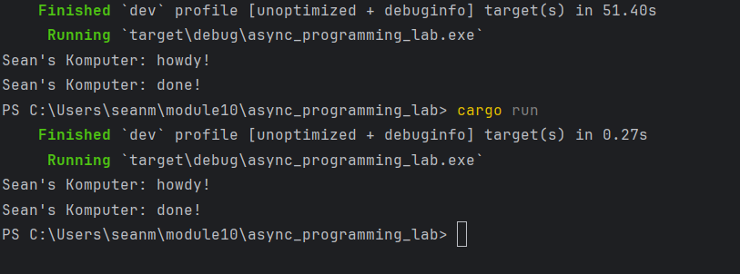
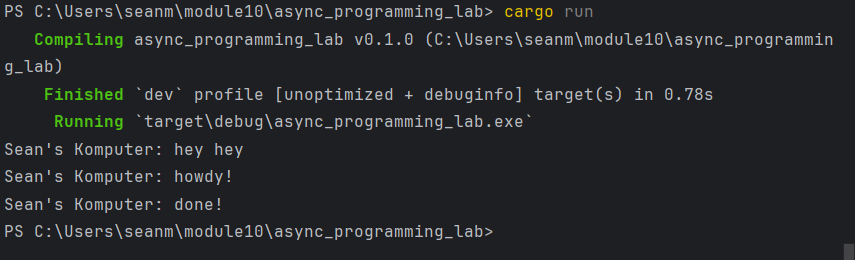
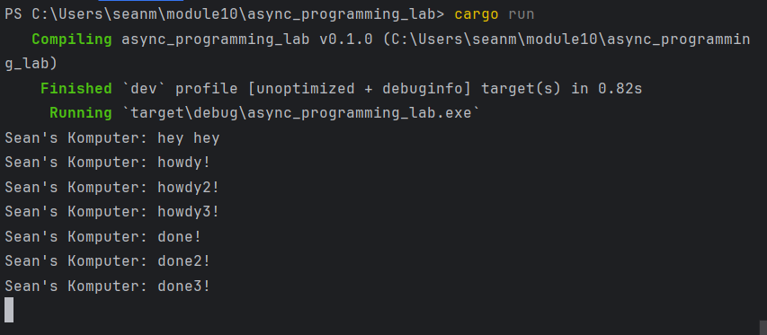
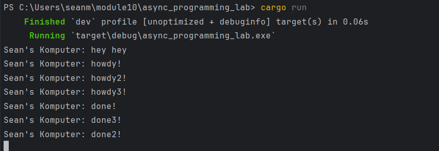

### “Experiment 1.1: Original timer from the book”

### “Experiment 1.2: Understanding how it works.”

Pada Experiment 1.2, urutan output menunjukkan bahwa pesan hey hey tercetak di terminal mendahului pesan howdy dan done yang berada di dalam blok asinkronus. Fenomena ini terjadi karena sifat dasar Future di dalam bahasa pemrograman Rust yang bersifat lazy atau malas, di mana sebuah instruksi asinkronus tidak akan langsung dieksekusi saat dideklarasikan. Ketika fungsi spawner.spawn dipanggil, ia hanya bertugas membungkus objek future tersebut ke dalam sebuah Task lalu mengirimkannya ke dalam antrean saluran komunikasi ready_queue milik Executor. Proses pendaftaran tugas ini berlangsung sangat cepat dan bersifat non-blocking, sehingga alur utama program (main thread) langsung melanjutkan eksekusi ke baris baris kode berikutnya tanpa menunggu blok asinkronus selesai diproses. Akibatnya, perintah mencetak pesan hey hey langsung dieksekusi terlebih dahulu oleh main thread. Blok kode asinkronus di dalam spawner baru akan benar-benar dijalankan dan dievaluasi ketika kendali program diserahkan sepenuhnya kepada fungsi executor.run di bagian akhir fungsi utama. Di dalam mesin executor inilah metode poll pertama kali dipicu untuk menjalankan tugas yang mengantre, yang kemudian mencetak kata howdy, menangguhkan diri selama dua detik saat menemui perintah await pada TimerFuture, dan akhirnya mencetak kata done setelah dibangunkan kembali oleh komponen waker.

### “Experiment 1.3: Multiple Spawn and removing drop”

Ketika pernyataan drop(spawner) dihapus atau dijadikan komentar, program akan mengalami gejala hang atau tertahan selamanya di dalam terminal dan tidak dapat menutup secara otomatis meskipun seluruh tugas cetak asinkronus sudah selesai diproses. Fenomena ini terjadi karena saluran komunikasi data antara komponen Spawner dan Executor menggunakan arsitektur Multi-Producer Single-Consumer channel yang terikat secara struktural. Di dalam fungsi executor.run, terdapat sebuah siklus perulangan yang akan terus berjalan selama saluran penerima atau ready_queue masih berada dalam status aktif dan terbuka untuk menerima kiriman tugas baru. Berdasarkan mekanisme manajemen memori Rust, saluran komunikasi tersebut hanya akan ditutup secara otomatis apabila seluruh instansi pengirim atau SyncSender yang terikat dengan objek spawner telah dihancurkan atau keluar dari ruang lingkup eksekusi. Oleh karena fungsi utama program masih memegang satu salinan objek spawner aktif yang tidak dihancurkan melalui fungsi drop, mesin executor akan terus mengasumsikan bahwa masih ada kemungkinan tugas baru yang akan dikirimkan di masa mendatang. Akibatnya, metode penerimaan data pada ready_queue akan terus memblokir alur kerja program untuk menunggu kiriman data baru tanpa pernah menyadari bahwa seluruh tugas asinkronus di dalam program sebenarnya telah selesai dieksekusi.

